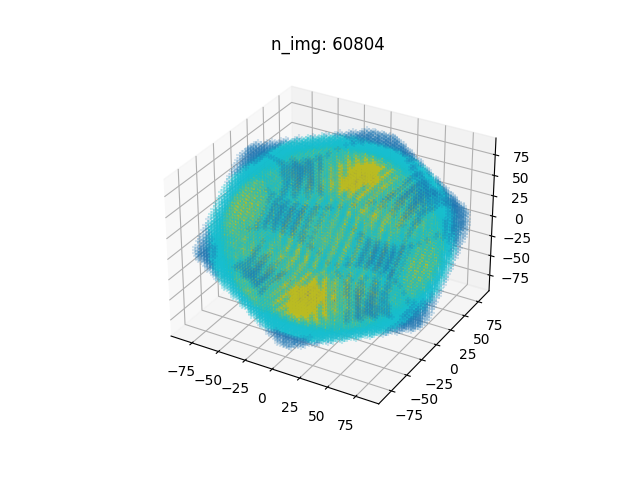

# RoomSimulator: a room impulse response simulator implemented in python

RoomSimulator is developed on the basis of **RoomSim** ([github](https://github.com/bingo-todd/Roomsim_Campbell)) developed by D. R. Campbell 

```shell
RoomSimulator/
├── AxisTransform.py 
├── DelayFilter.py
├── Directivity.py
├── log  
├── plot_cube.py
├── Receiver.py  
├── Reverb.py
├── Room.py
├── RoomSim.py
├── SENSOR
├── Source.py
├── utils.py
└── validation
```

## Usages

```python
room_config = configparser.ConfigParser()
# Configuration of room
room_config['Room'] = {
    'size': '4, 4, 4',
    'RT60': ', '.join([f'{item}' for item in np.ones(6) * 0.2]),
    'A': '',
    'Fs': 44100,
    'reflect_order': -1,
    'HP_cutoff': 100}

# Configuration of microphones
# two ears of listener
receiver_config = configparser.ConfigParser()
receiver_config['Receiver'] = {
    'pos': '2, 2, 2',
    'view': '0, 0, 0',
    'n_mic': '2'}
head_r = 0.145/2
receiver_config['Mic_0'] = {
    'pos': f'0, {head_r}, 0',
    'view': '0, 0, 90',
    'direct_type': 'binaural_L'}
receiver_config['Mic_1'] = {
    'pos': f'0, {-head_r}, 0',
    'view': '0, 0, -90',
    'direct_type': 'binaural_R'}

roomsim = RoomSim(room_config=room_config, source_config=None, receiver_config=receiver_config)

# configuration of sound source
azi = 0
azi_rad = azi/180*np.pi
source_config = configparser.ConfigParser()
source_config['Source'] = {
    'pos': f'{2+1*np.cos(azi_rad)}, {2+np.sin(azi_rad)}, 2',
    'view': '0, 0, 0',
    'directivity':'omnidirectional'}
roomsim.load_source_config(source_config)
fig, ax = roomsim.show()
ax.view_init(elev=60, azim=30)
fig.savefig(f'img/room.png', dpi=200)
plt.close(fig)

fig, ax = roomsim.cal_all_img(is_plot=True)
fig.savefig('img/image_sources.png')

rir = roomsim.cal_ir_mic(is_verbose=False, img_dir='img/verbose')
np.save('rir.npy', rir)

```

Moving the sound source around the microphones


All image sound sources whose delays are smaller then the RT60   



visualizing the calculating procedure of RIR


## Validation 

Comparison with RoomSim under the same settings of room, microphones and sound source.

Difference:

1. The restriction on how many image sources are considered, which is relaxed in RoomSimulator
2. Delay filter(allowing fraction delays) is adopted in RoomSimulator but not in RoomSim 


## others

- Allowed directives of sensor

   

  | null_sensor                             | omnidirectional                             | unidirectional                             | bidirectional                             | hemisphere                             |
  | --------------------------------------- | ------------------------------------------- | ------------------------------------------ | ----------------------------------------- | -------------------------------------- |
  |  |  |  |  |  |

  | cardoid                             | subcardoid                             | supercardoid                             | hpercardoid                              | dipole                             |
  | ----------------------------------- | -------------------------------------- | ---------------------------------------- | ---------------------------------------- | ---------------------------------- |
  |  |  |  |  |  |

  binaural

  | left ear                               | right ear                              |
  | -------------------------------------- | -------------------------------------- |
  |  |  |

  


- Delay filter

  

- Terminologies of rotation

   