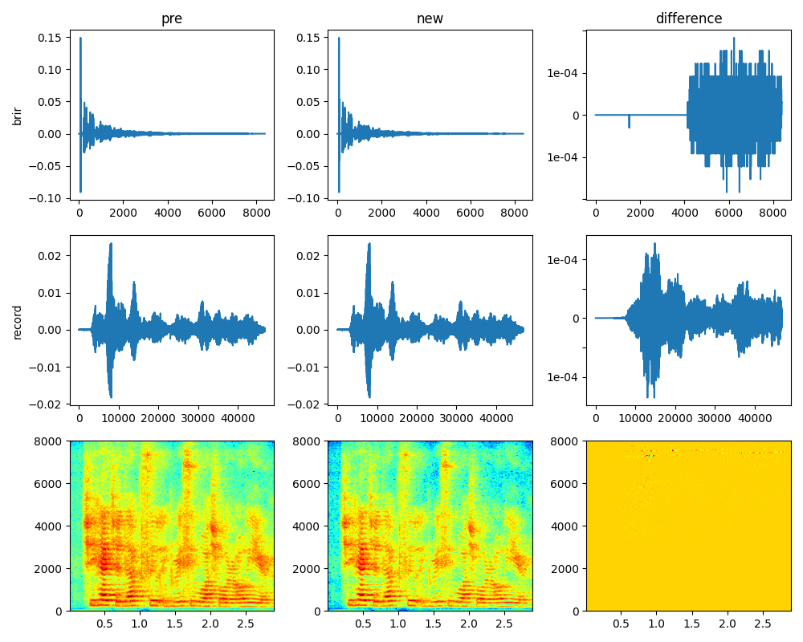

The effect of amp_theta of RoomSimulator

`pre`: $1e-6$			`new`: $1e-4$



Localization result (1task model)

```shell
$ python -m LocTools.load_log --loc-log data/pre/log/1.txt --chunksize 1
average result
cp:0.5744 rmse:21.8401
$ python -m LocTools.load_log --loc-log data/new/log/1.txt --chunksize 1
average result
cp:0.5744 rmse:21.8401
```

<table>
    <tr>
        <td>pre</td> <td>new</td>
    </tr>
    <tr>
        <td>  </td>
        <td>  </td>
    </tr>
</table>

